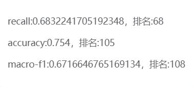
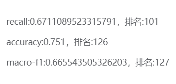
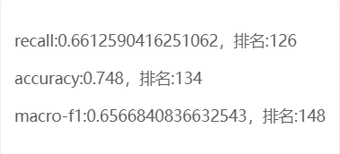
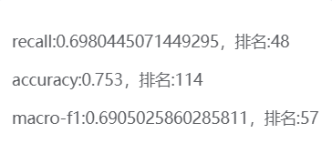

# 基于朴素贝叶斯和预训练Bert模型的中文句子情感分类实践 
## 1.任务介绍  
&emsp;&emsp;本次实践选题为AI研习社2019年9月份举办的中文对话情感分析任务，并在原任务基础上进行了拓展。任务首先给定一中文语句数据集，每个句子均有情绪标注，要求建模并预测测试集中每一句话的情绪。原任务为二分类问题，本次实践采用的数据集为知识发现与数据挖掘课程中所提供的中文语句数据集，其中每句话的情绪可分为6类:Happiness, Love, Sorrow, Fear, Disgust, None，分别用数字标签1-6代替。本次实践先采用了传统的朴素贝叶斯方法建模并预测，之后使用预训练的Bert模型进行了建模预测,并在最后对比了两种模型的效果差异。
## 2.数据集介绍  
&emsp;&emsp;本次实践采用研究生知识发现与数据挖掘课程所提供的中文语句数据集，训练集中共包含36810句中文语句，测试集共包含1000句中文语句，其中训练集中各情绪标签对应的语句数如表所示：

| 标签 | 语句数 |
| :--- | ------ |
| 1    | 5648   |
| 2    | 6512   |
| 3    | 2534   |
| 4    | 432    |
| 5    | 4138   |
| 6    | 17546  |

&emsp;&emsp;数据集中的句子及标签格式示例如下：


## 3.实践过程

### 3.1 朴素贝叶斯模型  
### 3.1.1 模型介绍  
&emsp;&emsp;朴素贝叶斯是分类任务中常用的机器学习模型，它首先基于特征条件独立假设学习输入输出的联合概率分布，然后基于此策略对给定的输入x，利用贝叶斯定理求出后验概率最大的输出y。  
&emsp;&emsp;本次任务中传统分类模型主要通过Python中sklearn库的朴素贝叶斯方法实现。sklearn库中封装了三个朴素贝叶斯的分类算法类，分别是：GaussianNB,MultinomialNB和BernoulliNB，其中，GaussianNB适用于样本特征分布为连续值的场景；MultinomialNB适用于样本特征为多元离散值的场景；BernoulliNB适用于样本特征是二元离散值或者很稀疏的多元离散值。本次任务要实现对不同的句子进行分类，故为离散值，使用类为MultinomialNB。

### 3.1.2 数据预处理  
&emsp;&emsp;本部分数据预处理过程主要实现两个流程，第一部分是对数据集中的句子进行分词处理。由于中文与英文的格式不同，对于英文处理可以直接使用空格取词后建立词典，而在处理中文数据时需要进行分词。本次实践分词使用Python中的常用的方法jieba库进行分词。
&emsp;&emsp;第二部分是采用目前NLP领域常用的提高分类准确率的方法即停用词处理，使用stopwords文件去掉如嗯、啊等对分类结果无明显作用的词语，本次实践采用的stopwords文件为哈工大公开的停用词表。（[川大停用词库,哈工大停用词表,百度停用词表百度网盘提取码4sm6](https://pan.baidu.com/s/1KBkOzYk-wRYaWno6HSOE9g)）  
&emsp;&emsp;经过两步处理后可以得到分词后的句子作为模型的输入数据，代码如下：

```python
#创建停用词表
def stopwordslist():
    stopwords = [line.strip() for line in open('newstopwords.txt',encoding='UTF-8').readlines()]
    return stopwords

#对每一行进行中文分词

def seg_depart(sentence):
    # 对文档中的每一行进行中文分词
    # print("正在分词")
    sentence_depart = jieba.cut(sentence.strip())
    # 创建一个停用词列表
    stopwords = stopwordslist()
    # 输出结果为outstr
    outstr = ''
    # 去停用词
    for word in sentence_depart:
        if word not in stopwords:
            if word != '\t':
                outstr += word
                outstr += " "
    return outstr
```
### 3.1.3 模型建立与训练  
&emsp;&emsp;朴素贝叶斯模型的建立与训练较为简单，不需要设置较为复杂的参数。首先，对所有输入句子的单词进行统计，建立词典allwords，并利用词典将中文句子数据转为词向量数据vector，之后将数据输入到MultinomialNB模型中进行训练即可。  
&emsp;&emsp;建模训练实践环境：CPU:Intel(R) Core(TM) i7-8750H CPU @ 2.20GHz   2.20 GHz；GPU:Nvidia Geforce GTX 1050ti  
&emsp;&emsp;由于本机实践环境限制，传统模型训练仅采用了10000条句子数据进行训练并进行了测试。代码如下：  

```python
labels = array(labels)
allwords = set()
print("开始统计")
for sen in articles:
    for word in sen:
        allwords.add(word)
allwords = list(allwords)
print("完成！！！！")
test = pd.read_csv('test_last.csv',encoding='UTF-8')
test = test.values.tolist()
# del test[4000:]
print(test[0:10])
results = list()
vector = list()
for sen in articles:
    temp = list(map(lambda x:sen.count(x),allwords))
    vector.append(temp)

model = MultinomialNB()
# model.cuda()
model.fit(vector,labels)
```
### 3.1.4 模型测试
&emsp;&emsp;模型测试主要通过model.predict()方法实现，将数据输入模型后统计输出结果并将预测标签结果输出到文件中进行保存。代码如下：
```python
def Predict(string):
    words = string.split(' ')
    currentVector = array(tuple(map(lambda x:words.count(x),allwords)))
    # currentVector.cuda()
    result = model.predict(currentVector.reshape(1,-1))
    return result
for i in test:
    result = Predict(i[0])
    results.append(result)
print(results[0:10])
test =pd.DataFrame(data = results)
test.to_csv('chuantong_result.csv',encoding='UTF-8',index=None,header=None)

result_index = 1
result_test = []
for label in results:
    x = {}
    x['ID'] = result_index
    x['Last Label'] = int(label)
    result_test.append(x)
    result_index += 1
with open("chuantong_result_last.csv",'w',newline='',encoding='UTF-8') as f_csv:
    writer = csv.writer(f_csv)
    writer.writerow(['ID','Last Label'])
    for n in result_test:
        writer.writerow(n.values())
```
## 3.2 预训练Bert模型  
###  3.2.1 模型介绍  
&emsp;&emsp;Bert模型是Google于2018年10月发布的自然语言处理模型，利用transformer的注意力机制，能实现很强大的自然语言处理应用。本次实践主要利用Python中transformers库的BertModel类实现，配合Pythorch进行模型的训练评估。

&emsp;&emsp;实践环境：CPU:Intel(R) Xeon(R) Gold 5215 CPU @ 2.50GHz；GPU：NVIDIA TESLA T4 16GB *2

### 3.2.2 模型建立与训练  
&emsp;&emsp;本部分数据预处理的过程与上文类似，获取输入数据后进行模型的构建，引入Bert模型，在最顶层加入分类功能，实现自定义的目的。因为功能简单线性，模型构建使用Pytorch的标准线性写法，Bert返回的是768维的张量。代码如下：  
```python
#模型构建
import torch.nn as nn


class MyBert(nn.Module):

    def __init__(self):
        super().__init__()
        self.bert = BertModel.from_pretrained("bert-base-chinese", return_dict=False)
        self.drop_out = nn.Dropout(0.1)
        self.dense = nn.Linear(768, 6)
        torch.nn.init.normal_(self.dense.weight, std=0.02)

    def forward(self, ids, mask, token_type_ids):
        _, out = self.bert(
            ids,
            attention_mask=mask,
            token_type_ids=token_type_ids
        )
        out = self.drop_out(out)
        logits = self.dense(out)
        return logits
```
&emsp;&emsp;完成模型的构建之后需要对输入的数据进行处理，使其能够输入到模型中进行计算。首先是配套使用transformer里的BertTokenizer分词方式对数据进行处理，然后输出的时候再转换成pytorch中的tensor格式。同时为了保证所有输入shape一致，需要对原始数据进行分类，即字符长度大于MAX_LEN和小于等于两种形式的处理，并进行padding处理。代码如下：
```python
def process_data(tweet, sentiment, tokenizer, max_len):
    tok_tweet = tokenizer(tweet)
    input_ids_orig = tok_tweet.input_ids[1:-1]
    input_ids = [101] + input_ids_orig + [102]
    token_type_ids = tok_tweet['token_type_ids']
    attention_mask = tok_tweet['attention_mask']

    padding_length = max_len - len(input_ids)
    if padding_length > 0:
        input_ids = input_ids + ([0] * padding_length)
        attention_mask = attention_mask + ([0] * padding_length)
        token_type_ids = token_type_ids + ([0] * padding_length)
    elif padding_length <= 0:  # 截断
        input_ids = [101] + input_ids_orig[:max_len - 2] + [102]
        attention_mask = attention_mask[:max_len]
        token_type_ids = token_type_ids[:max_len]

    return {  # 这里返回的是list格式的tensor
        'ids': input_ids,
        'mask': attention_mask,
        'token_type_ids': token_type_ids,
        'orig_tweet': tweet,
        'sentiment': sentiment,
    }
```
&emsp;&emsp;数据处理完成后开始构建训练函数并设置为每120批次返回一次训练结果，使用的优化器为在NLP领域表现比较好的AdamW优化器，部分代码如下：
```python
def train_fn(data_loader, model, optimizer, device, scheduler=None):
    model.train()
    tk0 = tqdm(data_loader, total=len(data_loader))

    for bi, d in enumerate(tk0):
        #         print(d)
        ids = d["ids"]
        token_type_ids = d["token_type_ids"]
        mask = d["mask"]
        sentiment = d["sentiment"]
        orig_tweet = d["orig_tweet"]

        sentiment = sentiment.to(device)
        ids = ids.to(device, dtype=torch.long)
        token_type_ids = token_type_ids.to(device, dtype=torch.long)
        mask = mask.to(device, dtype=torch.long)
        model.zero_grad()

        outputs = model(
            ids=ids,
            mask=mask,
            token_type_ids=token_type_ids,
        )
        #         loss = loss_fn(outputs_start, outputs_end, targets_start, targets_end)
        loss = loss_func(outputs, sentiment)
        loss.backward()
        optimizer.step()
        scheduler.step()

        outputs = torch.softmax(outputs, dim=1).cpu().detach().numpy()

        if bi % 120 == 0:
            print('Step:', bi)
            print('train loss: %.4f' % loss.item())
            print('outputs:', outputs)
            pred_y = torch.max(torch.tensor(outputs, dtype=torch.float), dim=1)[1].data.numpy()
            print('pred_y:', pred_y)
            accuracy = (sum(pred_y == np.array(sentiment.data.cpu())).item()) / sentiment.size(0)
            print('train accurancy: %.2f' % accuracy)
```
&emsp;&emsp;训练过程中的参数设置如下，本次训练的EPOCHS共设置了3，4，6，8四组，MAX_LEN共设置了64，128，256和512维四组。  
```python
TRAIN_BATCH_SIZE = 32
TEST_BATCH_SIZE = 16
VALID_BATCH_SIZE = 8
EPOCHS = 4
MAX_LEN = 128
```
&emsp;&emsp;训练完成后将模型保存，便于后续的加载测试。代如下：
```python
# 模型保存
torch.save({'state_dict': model.state_dict()}, 'bert_chinese_simple_4epoch_dict.pth.bar') #只保留参数
```
### 3.2.3 模型测试
&emsp;&emsp;测试集的数据处理与训练集类似，获取测试数据后首先需要加载之前训练后保存的模型，之后利用模型进行预测分类。代码如下：
```python
def test_fn(data_loader, model):
    final_output = []
    with torch.no_grad():
        tk0 = tqdm(data_loader, total=len(data_loader))

        for bi, d in enumerate(tk0):
            ids = d["ids"]
            token_type_ids = d["token_type_ids"]
            mask = d["mask"]
            orig_tweet = d["orig_tweet"]

            ids = ids.to(device, dtype=torch.long)
            token_type_ids = token_type_ids.to(device, dtype=torch.long)
            mask = mask.to(device, dtype=torch.long)

            outputs = model(
                ids=ids,
                mask=mask,
                token_type_ids=token_type_ids,
            )

            outputs_res = torch.softmax(outputs, dim=1).cpu().detach().numpy()

            for px, tweet in enumerate(orig_tweet):
                res_sentiment = np.argmax(outputs_res[px])
                final_output.append(res_sentiment)
    return final_output
```
# 4.实践结果
## 4.1 评价指标
&emsp;&emsp;本次实践评价采用东北大学数据挖掘课题组机器学习测评系统进行结果评估，共包含三项指标，分别为accuracy、recall和macro-F1值。
## 4.2 结果展示
### 4.2.1 朴素贝叶斯模型评估结果

&emsp;&emsp;朴素贝叶斯模型的结果评估如图所示：  


### 4.2.2 Bert预训练模型评估结果

&emsp;&emsp;Bert预训练模型3个Epoch，128维测试结果：


&emsp;&emsp;Bert预训练模型4个Epoch，128维测试结果：



&emsp;&emsp;Bert预训练模型8个Epoch，128维测试结果：



&emsp;&emsp;Bert预训练模型6个Epoch，64维测试结果：



&emsp;&emsp;Bert预训练模型6个Epoch，256维测试结果：



&emsp;&emsp;Bert预训练模型6个Epoch，512维测试结果：


### 4.2.3 实践结果分析

&emsp;&emsp;通过对比本次实践结果，能够发现，基于Bert预训练模型的方法总体效果要远远优于传统的机器学习朴素贝叶斯方法，而对于基于Bert预训练模型的方法，通过调整参数能够进一步提高模型性能。

# 5.实践总结

&emsp;&emsp;经过本次实践，我了解了更多自然语言处理方面的知识和技能，同时对于自然语言处理中常见的分词、embedding操作等更加熟悉，能够在实践中利用课上学到的知识解决问题。除此之外，此次实践最大的收获是熟练掌握了关于服务器模型训练方面的操作，自主完成了服务器虚拟环境配置，并学会利用服务器进行多卡训练模型，利用git、xftp等工具实现本地、服务器和仓库的同步。

&emsp;&emsp;总之，通过本次实践，我收获很多，在未来的学习生活中还需要继续锻炼，熟练各项操作，争取做得更好！

# 相关参考

&emsp;&emsp;[BERT模型详解](http://www.noobyard.com/article/p-zwhutqmm-nu.html)

&emsp;&emsp;[自然语言处理三大模型介绍](https://www.jianshu.com/p/8fc3baa4cf98)

&emsp;&emsp;[Bert模型（Pytorch）中文段落情感判断](https://zhuanlan.zhihu.com/p/452189363)


